<div align="center">

# 🔐 Secure CI/CD Pipeline
### Jenkins · Kubespray · SonarQube · Trivy

A Jenkins pipeline that builds, security-scans, and deploys a Node.js application to a **self-provisioned Kubernetes cluster** (via Kubespray) on AWS EC2 — with quality gates, secret scanning, dependency scanning, and container image scanning all enforced as real, build-blocking gates. Rolling update verified for **zero downtime**.

[](https://www.jenkins.io/)
[](https://www.sonarsource.com/products/sonarqube/)
[](https://github.com/aquasecurity/trivy)
[](https://github.com/kubernetes-sigs/kubespray)
[](https://hub.docker.com/u/eldho10)
[](https://aws.amazon.com/ec2/)

</div>

---

## 📑 Table of Contents

- [🏗️ Architecture](#️-architecture)
- [☁️ Infrastructure](#️-infrastructure)
- [🚦 Pipeline Stages](#-pipeline-stages)
- [🛡️ Enforcement Proof — Trivy Blocking a Vulnerable Build](#️-enforcement-proof--trivy-blocking-a-vulnerable-build)
- [🔄 Rolling Update / Zero Downtime](#-rolling-update--zero-downtime)
- [⚠️ Known Limitations](#️-known-limitations)
- [📂 Repo Layout](#-repo-layout)
- [👤 Author](#-author)

---

## 🏗️ Architecture

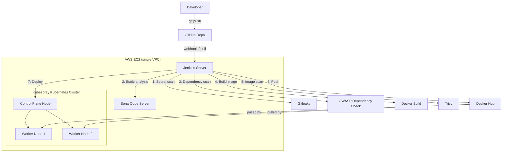

---

## ☁️ Infrastructure

| Component | Instance | OS |
|---|:---:|:---:|
| 🧩 Jenkins | t3.small EC2 | Ubuntu 24.04 |
| 📊 SonarQube (Community) | t3.small EC2 | Ubuntu 24.04 |
| ⚙️ Kubernetes control plane | t3.small EC2 | Ubuntu 24.04 |
| ⚙️ Kubernetes worker × 2 | t3.small EC2 | Ubuntu 24.04 |

All 5 instances sit in **one VPC / security group**, with a self-referencing "all traffic" rule so cluster and CI components can reach each other over private IPs — without opening the whole world to the internet.

<p align="center">
  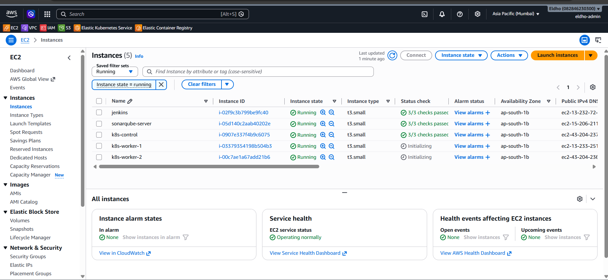
  <br><em>✅ All 5 EC2 instances running and healthy</em>
</p>

<p align="center">
  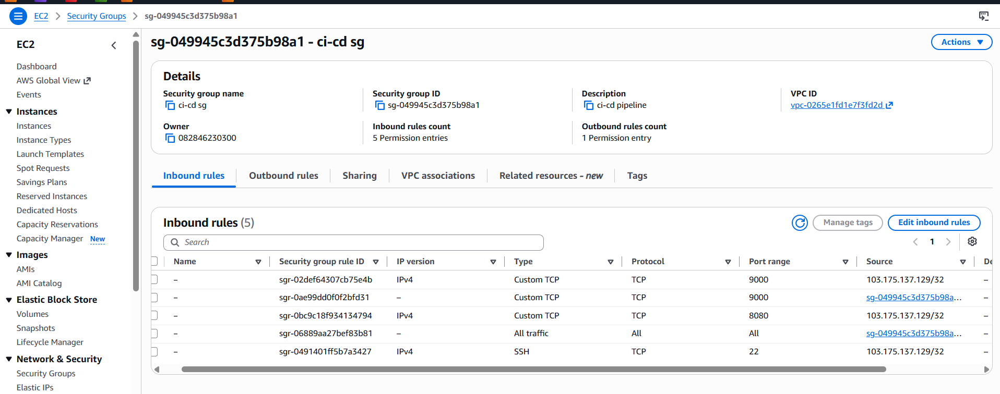
  <br><em>🔒 Security group inbound rules, including the self-referencing all-traffic rule</em>
</p>

The Kubernetes cluster was provisioned with **[Kubespray](https://github.com/kubernetes-sigs/kubespray)** (kubeadm + Calico under the hood) — a real, from-scratch cluster bootstrap, not a managed service like EKS.

<p align="center">
  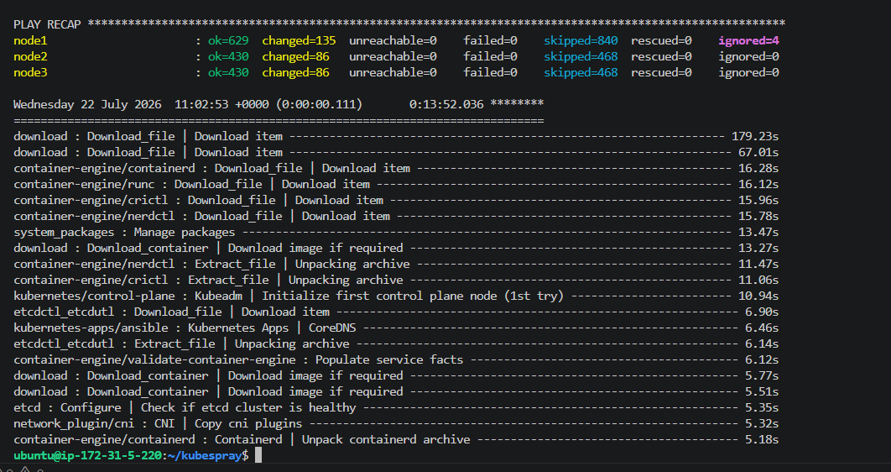
  <br><em>✅ Kubespray's Ansible run completing with zero failures across all 3 nodes</em>
</p>

<p align="center">
  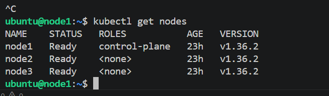
  <br><em>✅ All 3 cluster nodes Ready</em>
</p>

---

## 🚦 Pipeline Stages

| # | Stage | Tool | Enforcement |
|:---:|---|---|---|
| 1 | Checkout | Git | — |
| 2 | 🔑 Secret Detection | [Gitleaks](https://github.com/gitleaks/gitleaks) | Hard-fail on any secret found (`--exit-code=1`) |
| 3 | 📊 Static Analysis | [SonarQube](https://www.sonarsource.com/products/sonarqube/) Community | Reports issues, hotspots, duplication |
| 4 | 🚪 Quality Gate | SonarQube | Hard-fail if the gate doesn't pass (`abortPipeline: true`) |
| 5 | 📦 Dependency Scan | [OWASP Dependency-Check](https://owasp.org/www-project-dependency-check/) | `--failOnCVSS 7` (see [limitations](#️-known-limitations)) |
| 6 | 🐳 Build Image | Docker | — |
| 7 | 🛡️ Image Scan | [Trivy](https://github.com/aquasecurity/trivy) | Hard-fail on HIGH/CRITICAL CVEs (`--exit-code 1`) |
| 8 | ⬆️ Push Image | Docker Hub | Only reached if stage 7 passes |
| 9 | 🚀 Deploy | `kubectl` + Kubespray cluster | Waits on `kubectl rollout status`, fails the build if the rollout doesn't complete |

<p align="center">
  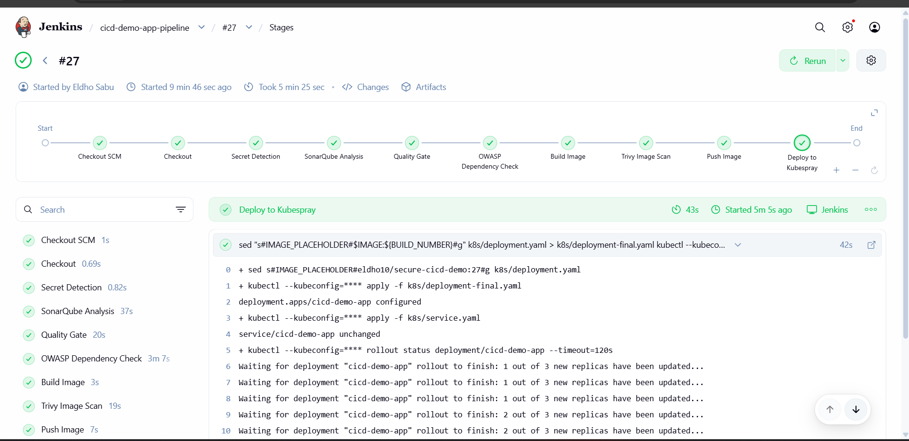
  <br><em>✅ Full pipeline (build #27) — all 9 stages passing, including every security gate</em>
</p>

<p align="center">
  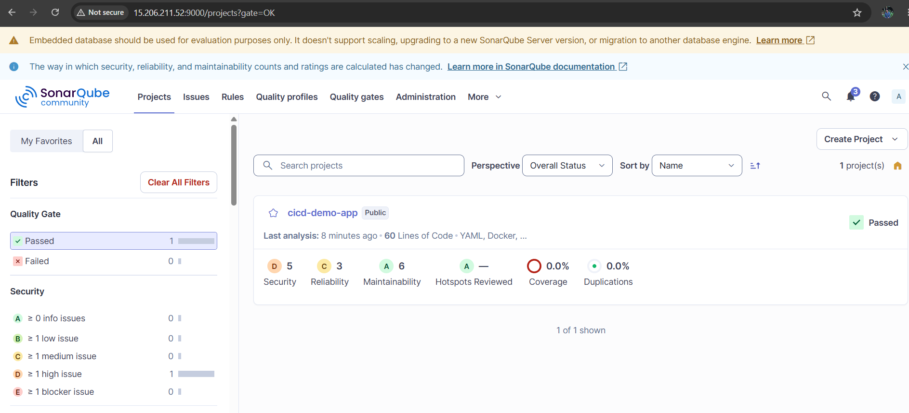
  <br><em>✅ SonarQube Quality Gate: Passed</em>
</p>

---

## 🛡️ Enforcement Proof — Trivy Blocking a Vulnerable Build

Security gates in this pipeline aren't advisory — **they actually stop a build from shipping.** An earlier run (`#23`), scanned before the base image was patched, correctly failed and blocked everything downstream:

<p align="center">
  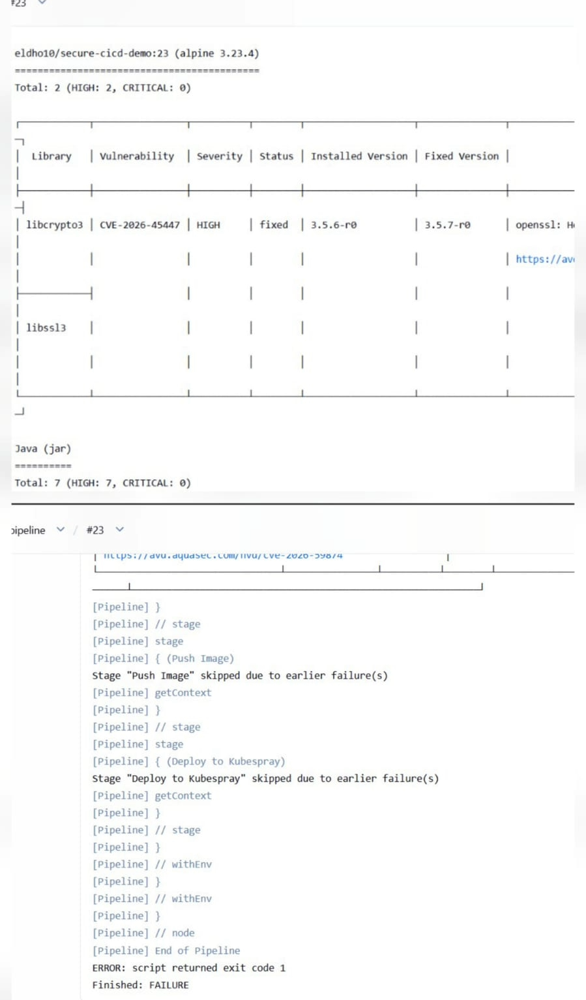
  <br><em>🛑 Trivy catching a real HIGH-severity CVE in the base image</em>
</p>

```text
libcrypto3 | CVE-2026-45447 | HIGH | fixed | 3.5.6-r0 | 3.5.7-r0 | openssl: Heap Use-After-Free...
...
Stage "Push Image" skipped due to earlier failure(s)
Stage "Deploy to Kubespray" skipped due to earlier failure(s)
Finished: FAILURE
```

**✅ Fix applied:** bumped the base image from `node:20-alpine` → `node:22-alpine`, and added a `.dockerignore` so SonarQube's local scan cache and generated reports weren't accidentally copied into the image and flagged as vulnerable dependencies.

Build `#27`, on the patched image, passed Trivy with **0 vulnerabilities** and deployed cleanly.

---

## 🔄 Rolling Update / Zero Downtime

The Kubernetes Deployment uses:

```yaml
strategy:
  type: RollingUpdate
  rollingUpdate:
    maxUnavailable: 0
    maxSurge: 1
```

`maxUnavailable: 0` guarantees **at least 3 pods are always serving traffic** — Kubernetes will not terminate an old pod until its replacement is confirmed `Running`.

**Verification method:** a curl loop hit the Service's ClusterIP every 0.5 seconds while a new deploy was triggered, with `kubectl get pods -w` watched in parallel to confirm the pod-replacement sequence.

<p align="center">
  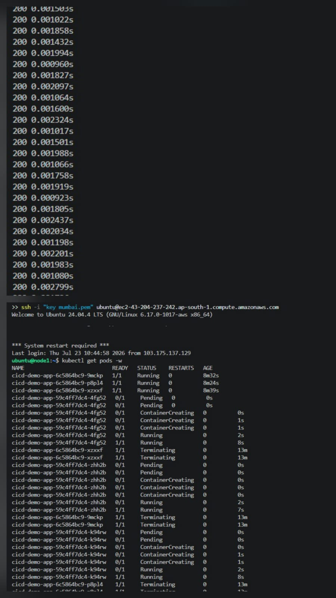
  <br><em>✅ Unbroken 200 OK responses (sub-3ms) throughout the rollout, alongside the pod transition log</em>
</p>

**Result:** unbroken `200 OK` responses for the entire rollout window. Each new pod reached `Running` before its corresponding old pod began `Terminating` — the cluster never had fewer than 3 healthy pods serving traffic at once.

<p align="center">
  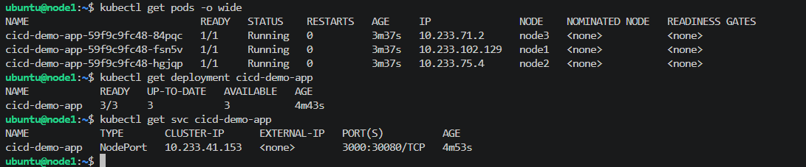
  <br><em>✅ Post-deploy state: 3/3 pods running, spread across all 3 nodes, service correctly exposed</em>
</p>

---

## ⚠️ Known Limitations

- **OWASP Dependency Check** is fully configured to enforce `--failOnCVSS 7`, but the NVD database sync proved unreliable on these resource-constrained t3.small lab instances — repeated timeouts, and even with an NVD API key, an occasional database-lock error when a prior sync was interrupted:

  <p align="center">
    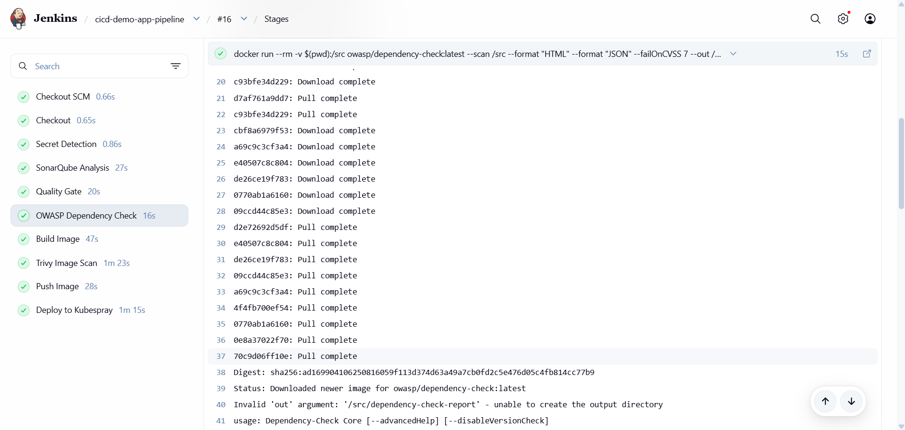
  </p>

  The stage is currently non-blocking (`timeout 180 ... || true`) so it can't stall the whole pipeline, and it still archives whatever report it manages to produce. In a production setup, this would run against a persistent, pre-warmed NVD database volume instead of syncing from scratch on constrained hardware every run.

- **SonarQube's Quality Gate** for this project enforces one condition (Duplicated Lines ≤ 5%) rather than the fuller default set. This is a small, test-less demo app — metrics like Coverage and "zero new issues" were deliberately relaxed rather than left permanently failing on a codebase with no test suite yet. A production Quality Gate would restore the fuller condition set once tests exist.

- **SonarQube** runs on its default embedded H2 database — fine for a lab, but SonarQube itself flags this configuration as evaluation-only, not for production use.

---

## 📂 Repo Layout

```
.
├── Jenkinsfile           # full pipeline definition
├── Dockerfile
├── .dockerignore
├── app.js
├── package.json
├── k8s/
│   ├── deployment.yaml
│   └── service.yaml
└── screenshots/          # evidence referenced in this README
```

---

## 👤 Author

<div align="center">

**Eldho Sabu**
*DevOps / Cloud Engineer (AWS)*

[](https://github.com/Eldho2827)
[](https://hub.docker.com/u/eldho10)
[](https://www.linkedin.com/in/eldhosabu08)

</div>
