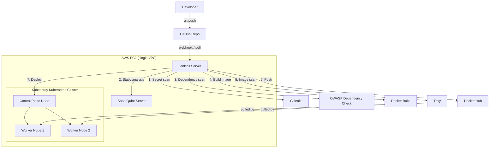

# Secure CI/CD Pipeline — Jenkins + Kubespray + SonarQube + Trivy

A Jenkins pipeline that builds, security-scans, and deploys a Node.js application to a self-provisioned Kubernetes cluster (via Kubespray) on AWS EC2, with a rolling update verified for zero downtime.

## Architecture



## Infrastructure

| Component | Instance | OS |
|---|---|---|
| Jenkins | t3.small EC2 | Ubuntu 24.04 |
| SonarQube (Community) | t3.small EC2 | Ubuntu 24.04 |
| Kubernetes control plane | t3.small EC2 | Ubuntu 24.04 |
| Kubernetes worker × 2 | t3.small EC2 | Ubuntu 24.04 |

All 5 instances sit in one VPC / security group, with a self-referencing "all traffic" rule so cluster and CI components can reach each other over private IPs without opening the whole world.


The Kubernetes cluster was provisioned with [Kubespray](https://github.com/kubernetes-sigs/kubespray) (kubeadm + Calico under the hood) — not a managed service:


## Pipeline stages

1. **Checkout** — pulls from GitHub
2. **Secret Detection** — [Gitleaks](https://github.com/gitleaks/gitleaks) scans the full repo history; hard-fails the build on any finding (`--exit-code=1`)
3. **SonarQube Analysis** — static analysis via `sonar-scanner-cli` against a self-hosted SonarQube Community server
4. **Quality Gate** — Jenkins blocks on SonarQube's verdict and aborts the pipeline if it fails (`abortPipeline: true`)
5. **OWASP Dependency Check** — scans dependencies against the NVD CVE database (`--failOnCVSS 7`) — see [Known limitations](#known-limitations)
6. **Build Image** — Docker build of the Node.js app
7. **Trivy Image Scan** — scans the built image for HIGH/CRITICAL CVEs, hard-fails the build (`--exit-code 1`)
8. **Push Image** — pushes the passing image to Docker Hub
9. **Deploy to Kubespray** — applies Deployment/Service manifests, waits on `kubectl rollout status`


## Enforcement proof — Trivy blocking a vulnerable build

Security gates aren't just informational — they actually stop bad builds. An earlier run (`#23`), scanned before the base image was patched, correctly failed and blocked the rest of the pipeline:


```
libcrypto3 | CVE-2026-45447 | HIGH | fixed | 3.5.6-r0 | 3.5.7-r0 | openssl: Heap Use-After-Free...
...
Stage "Push Image" skipped due to earlier failure(s)
Stage "Deploy to Kubespray" skipped due to earlier failure(s)
Finished: FAILURE
```

After bumping the base image (`node:20-alpine` → `node:22-alpine`) and adding a `.dockerignore` (so SonarQube's local cache and report files don't get copied into the image), build `#27` passed Trivy with 0 vulnerabilities and deployed cleanly.

## Rolling update / zero downtime

The Deployment uses:
```yaml
strategy:
  type: RollingUpdate
  rollingUpdate:
    maxUnavailable: 0
    maxSurge: 1
```
`maxUnavailable: 0` guarantees at least 3 pods are always serving traffic — Kubernetes won't terminate an old pod until its replacement is confirmed `Running`.

**Verification:** ran a curl loop against the Service's ClusterIP every 0.5s while triggering a new deploy, watching `kubectl get pods -w` at the same time.


Result: unbroken `200 OK` responses (sub-3ms) for the entire rollout window. In the pod log, each new pod reached `Running` before its corresponding old pod began `Terminating` — never fewer than 3 healthy pods at once.


## Known limitations

- **OWASP Dependency Check** is fully wired up with `--failOnCVSS 7`, but the NVD database sync proved unreliable on these resource-constrained t3.small lab instances — repeated timeouts and, even with an NVD API key, an occasional H2-database lock error when a prior run was interrupted:

  

  The stage is currently non-blocking (`timeout 180 ... || true`) so it can't stall the pipeline, and it archives whatever report it manages to produce. In a production setup this would run against a persistent, pre-warmed NVD database volume instead of syncing from scratch on constrained hardware.
- SonarQube's Quality Gate for this project enforces one condition (Duplicated Lines ≤ 5%) rather than the fuller default set. This is a small, test-less demo app — metrics like Coverage and "zero new issues" were relaxed rather than left permanently failing on a codebase with no test suite yet. A production Quality Gate would restore the fuller condition set once tests exist.
- SonarQube runs on its default embedded H2 database — fine for this lab, but SonarQube itself flags it as evaluation-only, not for production.

## Repo layout

```
.
├── Jenkinsfile           # full pipeline definition
├── Dockerfile
├── .dockerignore
├── app.js
├── package.json
├── k8s/
│   ├── deployment.yaml
│   └── service.yaml
└── screenshots/          # evidence referenced in this README
```
